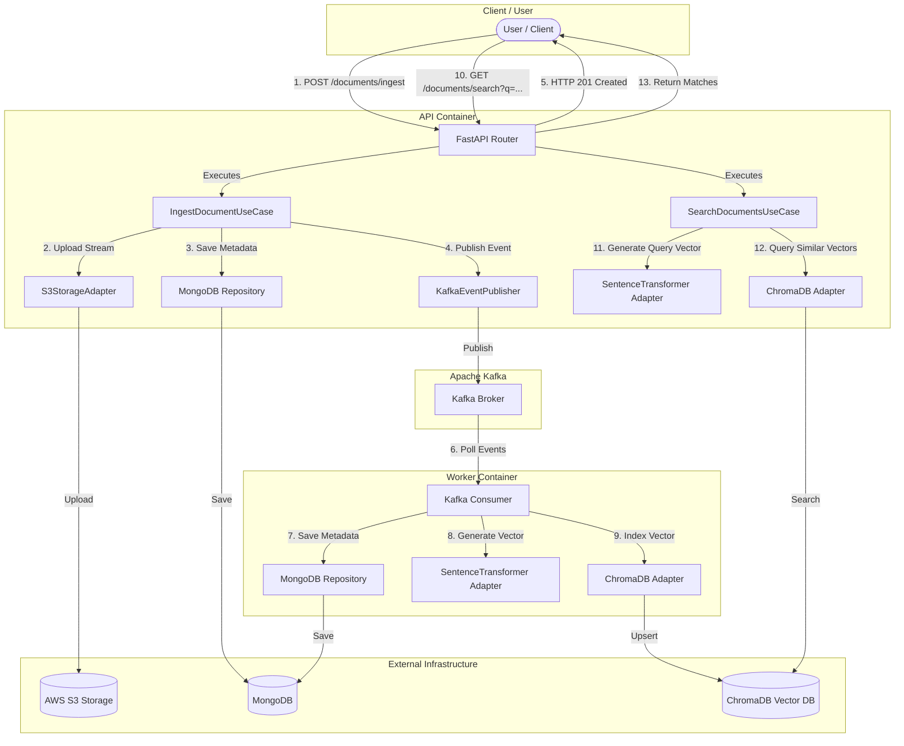

# Semantic Search & Ingestion Engine

[](#)
[](#)
[](#)
[](#)

An enterprise-grade, asynchronous document ingestion and semantic search engine built using Python, FastAPI, Apache Kafka, MongoDB, and AWS services, following the **Hexagonal Architecture (Ports & Adapters)** design pattern.

---

## 🎯 Project Objective

The primary objective of this project is to demonstrate a production-ready, highly resilient, and decoupled distributed system capable of handling high-throughput document ingestion. By using an event-driven flow with Apache Kafka, the ingestion API remains responsive and fast, offloading CPU-bound tasks (such as document processing, dense vector representation, and vector indexing) to background worker instances.

---

## 🏗️ Architecture & Best Practices

This project strictly adheres to **Clean Architecture** and **Hexagonal Architecture** principles.

### 📐 System Architecture Diagram

The end-to-end flow of document ingestion, asynchronous background processing, and semantic search queries is visualized below:



### 📦 Monorepo & Hexagonal Layer Structure

This repository is organized as a monorepo containing two **completely decoupled and self-contained microservices** that share no build-time code or runtime dependencies, ensuring high autonomy:
1. **API Service ([API/](file:///home/ryan-dev/Documentos/projetos/motor-ingestao-busca/API))**: Exposes REST ingestion and search routes.
2. **Worker Service ([worker/](file:///home/ryan-dev/Documentos/projetos/motor-ingestao-busca/worker))**: Consumes raw documents from Kafka, generates vector representations, and indexes them in ChromaDB.

Both microservices implement their own isolated **Hexagonal Architecture (Ports & Adapters)** layer structure:

* **Domain Layer (Core)**: Completely isolated from frameworks, containing core entities (e.g., [Document](file:///home/ryan-dev/Documentos/projetos/motor-ingestao-busca/API/src/domain/entities/document.py) in the API, and [Document](file:///home/ryan-dev/Documentos/projetos/motor-ingestao-busca/worker/src/domain/entities/document.py) in the Worker), exceptions, and abstract ports:
  - API ports: [StoragePort](file:///home/ryan-dev/Documentos/projetos/motor-ingestao-busca/API/src/domain/ports/storage.py), [EventPublisher](file:///home/ryan-dev/Documentos/projetos/motor-ingestao-busca/API/src/domain/ports/event_publisher.py), [DocumentRepository](file:///home/ryan-dev/Documentos/projetos/motor-ingestao-busca/API/src/domain/ports/document_repository.py), [EmbeddingPort](file:///home/ryan-dev/Documentos/projetos/motor-ingestao-busca/API/src/domain/ports/embedding.py), [VectorStorePort](file:///home/ryan-dev/Documentos/projetos/motor-ingestao-busca/API/src/domain/ports/vector_store.py).
  - Worker ports: [DocumentRepository](file:///home/ryan-dev/Documentos/projetos/motor-ingestao-busca/worker/src/domain/ports/document_repository.py), [EmbeddingPort](file:///home/ryan-dev/Documentos/projetos/motor-ingestao-busca/worker/src/domain/ports/embedding.py), [VectorStorePort](file:///home/ryan-dev/Documentos/projetos/motor-ingestao-busca/worker/src/domain/ports/vector_store.py).
* **Application Layer**: Contains use cases coordinating the domain model (e.g. [IngestDocumentUseCase](file:///home/ryan-dev/Documentos/projetos/motor-ingestao-busca/API/src/application/use_cases/ingest_document.py) and [SearchDocumentsUseCase](file:///home/ryan-dev/Documentos/projetos/motor-ingestao-busca/API/src/application/use_cases/search_documents.py)).
* **Infrastructure Layer**: Framework-specific adapters implementing the domain ports (MongoDB, confluent-kafka, AWS S3, ChromaDB).
* **Resilient Worker Loop**: The Kafka consumer includes fallback handling to guarantee that processing errors on a single message do not block or crash the consumer daemon.

---

## 🛠️ Technology Stack

- **FastAPI**: Asynchronous API framework.
- **Apache Kafka**: Decoupled event broker for message passing.
- **MongoDB (Motor)**: Document database for persisting metadata.
- **ChromaDB**: High-performance vector database for semantic indexing.
- **Sentence-Transformers (`all-MiniLM-L6-v2`)**: Generates 384-dimensional dense vector representations of documents.
- **AWS S3 / LocalStack**: Binary/raw storage for ingested documents.
- **AWS CloudWatch**: Standard log group registry.
- **Poetry**: Package dependency management.
- **Docker & Docker Compose**: Container orchestration.

---

## 🚀 Getting Started

### 📋 Prerequisites

- **Docker** and **Docker Compose** installed.

### ⚙️ Setup & Configuration

1. Clone this repository.
2. Initialize your local configuration file:
   ```bash
   cp .env.example .env
   ```
   *(The `.env` file is already listed in `.gitignore` and won't be pushed to git)*

### 🐳 Run with Docker Compose

Build and launch all services in the background (Kafka, MongoDB, ChromaDB, LocalStack, Ingestion API, and the processing Worker):

```bash
docker compose up --build -d
```

Check service health logs:
```bash
docker compose logs api
docker compose logs worker
```

---

## 📡 API Usage Guide

### 1. Health Check
Verify the API is running correctly.

* **URL**: `/`
* **Method**: `GET`
* **Curl Command**:
  ```bash
  curl -X GET http://localhost:8000/
  ```
* **Response (200 OK)**:
  ```json
  {
    "status": "ok"
  }
  ```

### 2. Ingest Document
Submits a document to be uploaded raw to S3 and queued in Kafka for async extraction, processing, metadata storage, and vector indexing.

* **URL**: `/documents/ingest`
* **Method**: `POST`
* **Request Header**: `Content-Type: application/json`
* **Request Body**:
  ```json
  {
    "content": "The company policy requires all employees to submit their monthly expense reports by the last Friday of each month.",
    "metadata": {
      "user_id": "123",
      "category": "finance",
      "author": "John Doe"
    }
  }
  ```
* **Curl Command**:
  ```bash
  curl -X POST http://localhost:8000/documents/ingest \
    -H "Content-Type: application/json" \
    -d '{"content": "The company policy requires all employees to submit their monthly expense reports by the last Friday of each month.", "metadata": {"user_id": "123", "category": "finance", "author": "John Doe"}}'
  ```
* **Response (201 Created)**:
  ```json
  {
    "id": "e0bfa934-8b64-4bf8-b99b-3ee9c27ee98d",
    "content": "The company policy requires all employees to submit their monthly expense reports by the last Friday of each month.",
    "metadata": {
      "user_id": "123",
      "category": "finance",
      "author": "John Doe"
    },
    "created_at": "2026-07-02T19:35:10.512Z"
  }
  ```

### 3. Semantic Search
Search for similar documents using natural language. The API generates an embedding for the query and searches the vector store using cosine similarity.

* **URL**: `/documents/search`
* **Method**: `GET`
* **Query Parameters**: `q` (The search query)
* **Curl Command**:
  ```bash
  curl -X GET "http://localhost:8000/documents/search?q=expense%20deadline"
  ```
* **Response (200 OK)**:
  ```json
  [
    {
      "id": "e0bfa934-8b64-4bf8-b99b-3ee9c27ee98d",
      "content": "The company policy requires all employees to submit their monthly expense reports by the last Friday of each month.",
      "metadata": {
        "user_id": "123",
        "category": "finance",
        "author": "John Doe"
      },
      "score": 0.894310
    }
  ]
  ```

---

## 🧪 Running Tests

You can run unit and integration tests inside the dedicated docker test containers.

### Run API Tests
```bash
docker compose run --rm api-test
```

### Run Worker Tests
```bash
docker compose run --rm worker-test
```

Alternatively, if you want to run tests locally with Poetry:
```bash
# Inside API/ directory
cd API && poetry install && poetry run pytest

# Inside worker/ directory
cd worker && poetry install && poetry run pytest
```

---

## ⚡ Load Testing & Performance Optimization

To validate the high-throughput capabilities and check the decoupling under stress, we ran load tests using **k6** simulating **100 concurrent virtual users (VUs)** for 30 seconds.

### Mixed Workload Benchmark (60% Ingestion / 40% Semantic Search)

| Metric | Before Optimization | After Optimization | Improvement |
| :--- | :--- | :--- | :--- |
| **Total Completed Requests** | 1,950 | **4,392** | **+125%** (More than double throughput) |
| **Throughput (req/s)** | 64.93 req/s | **146.36 req/s** | **+125%** |
| **Average Ingest Latency** | 1,167 ms | **398.90 ms** | **~3x Faster** |
| **Median Ingest Latency** | 1,234 ms | **417.57 ms** | **~3x Faster** |
| **Minimum Ingest Latency** | 16.49 ms | **5.82 ms** | **~3x Faster** |
| **p(95) Ingest Latency** | 1,821 ms | **685.51 ms** | **~2.7x Faster** |
| **Average Search Latency** | 674.77 ms | **450.95 ms** | **~1.5x Faster** |

### 🛠️ Key Architectural Optimizations Implemented

1. **Non-Blocking S3 Upload (Thread Pool Offloading):** 
   Converted the `S3StorageAdapter.upload_stream` method into an async coroutine. Wrapping boto3's synchronous `upload_fileobj` inside `asyncio.to_thread` offloads I/O-bound disk and network operations to Python's internal thread pool, freeing the main ASGI event loop.
2. **Re-use of S3 Adapter Singleton:** 
   Restructured the FastAPI dependency tree so the `S3StorageAdapter` is instantiated once during application startup lifespan (`app.state.storage_adapter`) and re-used as a singleton. This eliminates redundant boto3 client creations and `create_bucket` S3 network calls on every HTTP request.
3. **Asynchronous Kafka Event Production (Removing Blocking Flush):** 
   Removed the per-request synchronous `flush()` call inside `KafkaEventPublisher.publish_document_created`. The publisher now enqueues events asynchronously using confluent-kafka's C-backed memory buffer and triggers callbacks via non-blocking `.poll(0)`. A final `flush(timeout=5)` is executed once when the application shuts down.

### 🏃 Running Load Tests

To run the load test locally, make sure the services are running (`docker compose up -d`) and k6 is installed:

```bash
k6 run teste-carga.js
```

### 📉 Constrained Environment Benchmarks (Realistic Production Simulation)

To simulate a realistic cloud deployment (e.g., small Kubernetes pods or AWS ECS tasks), we configured strict resource limits on the Docker containers in `docker-compose.yml`:
* **API Service:** Restricted to **0.5 CPU cores** and **1 GB RAM**.
* **Worker Service:** Restricted to **1.0 CPU cores** and **1.5 GB RAM**.

Running the exact same workload (100 VUs, 30s) in this constrained environment produced the following results:

| Metric | Constrained Environment | Analysis & Architectural Insights |
| :--- | :--- | :--- |
| **Total Completed Requests** | 775 | Lower overall throughput due to strict CPU throttling. |
| **Throughput (req/s)** | 25.75 req/s | Constrained but highly stable with **0.00% request errors**. |
| **Average Ingest Latency** | 2,398.34 ms | Higher average due to shared host disk/network scheduling. |
| **Minimum Ingest Latency** | **5.62 ms** | Confirms the async non-blocking path is fast when the queue is clear. |
| **p(95) Ingest Latency** | 4,065.39 ms | Shows queueing latency at the container gateway when throttled. |
| **Average Search Latency** | 2,756.77 ms | Heavy CPU impact due to in-process query vector embedding generation. |

#### 💡 Key Architectural Takeaways

1. **Embedding Generation Bottleneck:** Because the search endpoint generates embeddings in-process via `SentenceTransformer` on a CPU-bound thread, the 0.5 CPU restriction creates CPU saturation when many requests queue up.
2. **Production Recommendations:** To scale search throughput in a real-world system:
   * **Offload Embeddings:** Outsource query embedding generation to a dedicated model serving tier (like AWS SageMaker, Triton, or Hugging Face TEI) running on optimized or GPU-enabled instances.
   * **Lightweight / External Models:** Use lightweight embedding models or standard third-party APIs (like OpenAI embeddings) to convert search CPU-bound tasks into simple, fast, non-blocking HTTP requests.

